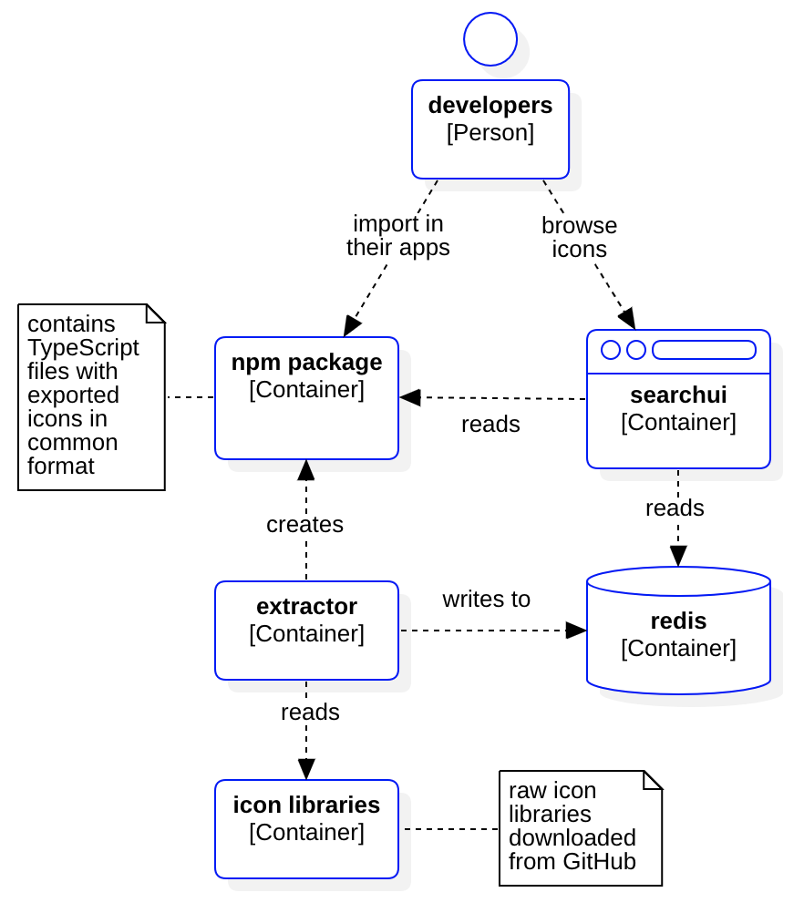

# icommon

This project establishes one common format for different icon libraries.

The goal is to improve the developer experience by providing an npm package and
a web application for icon search.

## Links

| Link                        | Description          |
|-----------------------------|----------------------|
| https://icommon.graaphs.com | icon search UI       |
| https://npm.com             | icons npm package    |
| https://github.com          | icons package source |

## Supported icon libraries

| Name                   | Link                                               |
|------------------------|----------------------------------------------------|
| boxicons               | https://github.com/atisawd/boxicons                |
| Bytesize Icons         | https://github.com/danklammer/bytesize-icons       |
| Fluent UI System Icons | https://github.com/microsoft/fluentui-system-icons |
| Font Awesome           | https://github.com/FortAwesome/Font-Awesome        |
| Primer Octicons        | https://github.com/primer/octicons                 |
| Radix Icons            | https://github.com/radix-ui/icons                  |
| Remix Icon             | https://github.com/Remix-Design/RemixIcon          |
| Unicons                | https://github.com/Iconscout/unicons               |

## Architecture

C4 diagram built with https://staruml.io